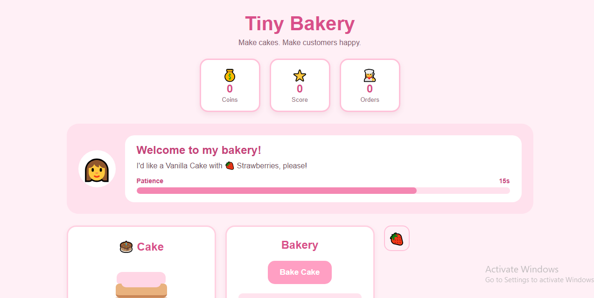
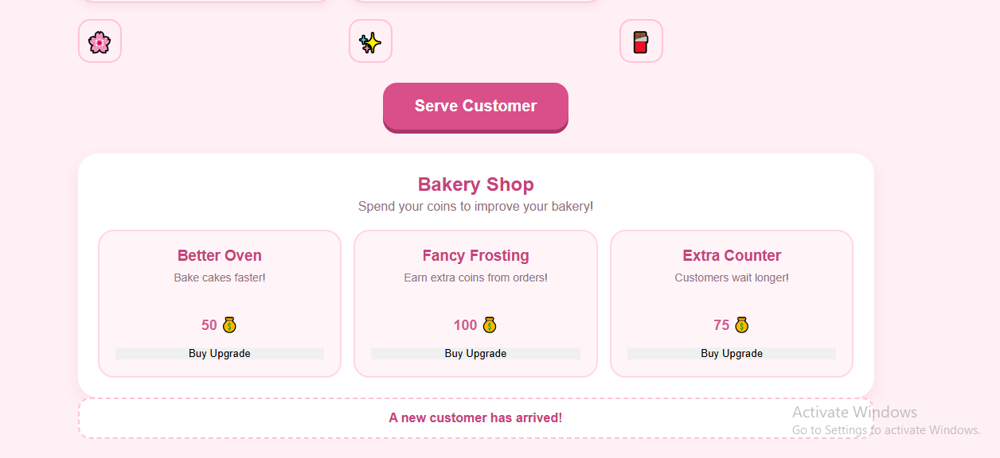

# Tiny Bakery 

A cute browser-based bakery game where players take customer orders, bake cakes, decorate them, and serve customers before they run out of patience.

## Description

**Run a Tiny Bakery** is a simple interactive bakery management game built using HTML, CSS, and JavaScript. Players receive randomly generated customer orders for different cake flavors and decorations, bake the requested cake, decorate it correctly, and serve it to the customer. Players earn coins and score points by successfully completing orders while managing the customer's patience timer. The game also includes a bakery shop where players can spend their coins on upgrades such as a Better Oven, Fancy Frosting, and Extra Counter. These upgrades affect gameplay by making cakes bake faster, increasing the coins earned from successful orders, and giving customers more patience. The game also uses browser local storage to save the player's coins, score, completed orders, and purchased upgrades between sessions.

### Screenshots




## Getting Started

### Dependencies

* A modern web browser such as Google Chrome, Microsoft Edge, Firefox, or Safari
* No additional libraries or frameworks are required
* Internet connection is not required after the project files have been downloaded
* Windows, macOS, or Linux can be used

### Installing

* Download or clone this repository from GitHub.
* If downloading the ZIP file, extract it to a folder on your computer.
* Make sure the following files are kept together:

  * `index.html`
  * `style.css`
  * `script.js`
* No additional installation or configuration is required.

To clone the repository using Git:

```bash
git clone https://github.com/sakinazehrapk-maker/tiny-bakery.git
```

Then open the project folder:

```bash
cd tiny-bakery
```

### Executing program

* Open the project folder.
* Double-click `index.html` to open the game in your web browser.

Or, if using Visual Studio Code:

1. Open the `tiny-bakery` folder in Visual Studio Code.
2. Open `index.html`.
3. Use a browser or a Live Server extension to launch the game.
4. The bakery game will appear in the browser.

The game can then be played by:

1. Receiving a random customer order.
2. Clicking **Bake Cake** to bake the requested cake.
3. Choosing the correct decoration.
4. Serving the completed cake to the customer.
5. Earning coins and score for successful orders.
6. Using earned coins to purchase bakery upgrades.
7. Continuing to serve customers while managing their patience.

## Help

If the game does not start:

* Make sure `index.html`, `style.css`, and `script.js` are in the same folder.
* Check that the file names are spelled correctly.
* Make sure the following line exists in `index.html`:

```html
<script src="script.js"></script>
```

* Make sure the following line exists in the `<head>` section of `index.html`:

```html
<link rel="stylesheet" href="style.css">
```

If the game stops responding or buttons do not work, open the browser's Developer Tools and check the **Console** for JavaScript errors.

In Google Chrome:

```text
F12 → Console
```

If saved progress is behaving unexpectedly, clearing the browser's local storage will reset the game.

## License

This project is licensed under the [MIT License](LICENSE.md) License - see the LICENSE.md file for details.

Made for Pixl Hackclub!